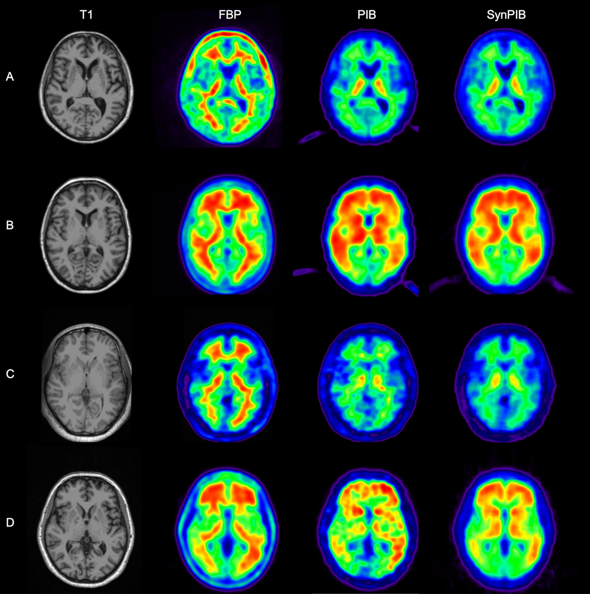

# RIED-Net
Official PyTorch implementation of [**Deep Residual Inception Encoder-Decoder Network for Amyloid PET Harmonization**](https://alz-journals.onlinelibrary.wiley.com/doi/10.1002/alz.12564) [Alzheimer's & Dementia]

[Jay Shah](https://www.public.asu.edu/~jgshah1/)<sup>1,2</sup>,
Fei Gao<sup>1,2</sup>, 
[Baoxin Li](https://www.public.asu.edu/~bli24/)<sup>1,2</sup>,
Valentina Ghisays<sup>3</sup>, 
Ji Luo<sup>3</sup>, 
Yinghua Chen<sup>3</sup>, 
Wendy Lee<sup>3</sup>, 
Yuxiang Zhou<sup>4</sup>, 
[Tammie L.S. Benzinger](https://scholar.google.com/citations?user=fr-fkIwAAAAJ&hl=en)<sup>5</sup>, 
[Eric M. Reiman](https://scholar.google.com/citations?user=I-Khl7AAAAAJ&hl=en)<sup>3</sup>,
[Kewei Chen](https://scholar.google.com/citations?user=d83ZIzEAAAAJ&hl=en)<sup>3</sup>,
[Yi Su](https://scholar.google.com/citations?user=vdZKSEIAAAAJ&hl=en)<sup>1,2,3</sup>,
[Teresa Wu](https://labs.engineering.asu.edu/wulab/person/teresa-wu-2/)<sup>1,2</sup>

<sup>1</sup>ASU-Mayo Center for Innovative Imaging,
<sup>2</sup>Arizona State University,
<sup>3</sup>Banner Alzheimer’s Institute,
<sup>4</sup>Dept of Radiology, Mayo Clinic, Arizona,
<sup>5</sup>Mallinckrodt Inst. of Radiology, Washington University

---

Visual comparison of synthetic images generated using RIED-Net to real Pittsburgh Compound-B (PIB) data for the OASIS ( A &amp; B) and GAAIN (C &amp; D) datasets


## Citation

Please consider citing FasterViT if this repository is useful for your work. 

```
@article{shah2022deep,
  title={Deep residual inception encoder-decoder network for amyloid PET harmonization},
  author={Shah, Jay and Gao, Fei and Li, Baoxin and Ghisays, Valentina and Luo, Ji and Chen, Yinghua and Lee, Wendy and Zhou, Yuxiang and Benzinger, Tammie LS and Reiman, Eric M and others},
  journal={Alzheimer's \& Dementia},
  volume={18},
  number={12},
  pages={2448--2457},
  year={2022},
  publisher={Wiley Online Library}
}
```
